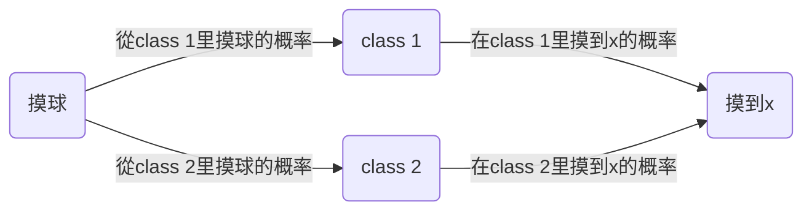
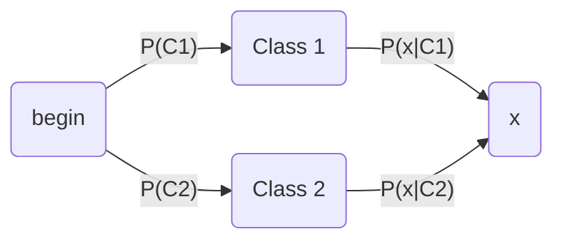

# Classification: Probabilistic Generative Model

#### Classification

##### 概念描述

分類問題是找一個 function，它的 input 是一個 object，它的輸出是這個 object 屬於哪一個 class

還是以寶可夢為例，已知寶可夢有 18 種屬性，現在要解決的分類問題就是做一個寶可夢種類的分類器，我們要找一個 function，這個 function 的 input 是某一隻寶可夢，它的 output 就是這只寶可夢屬於這 18 類別中的哪一個 type

##### 輸入數值化

對於寶可夢的分類問題來說，我們需要解決的第一個問題就是，怎麼把某一隻寶可夢當做 function 的 input？

==**要想把一個東西當做 function 的 input，就需要把它數值化**==

特性數值化：用一組數字來描述一隻寶可夢的特性

比如用一組數字表示它有多強(total strong)、它的生命值(HP)、它的攻擊力(Attack)、它的防禦力(Defense)、它的特殊攻擊力(Special Attack)、它的特殊攻擊的防禦力(Special defend)、它的速度(Speed)

以皮卡丘為例，我們可以用以上七種特性的數值所組成的 vector 來描述它

#### How to classification

##### Training data for Classification

假設我們把編號 400 以下的寶可夢當做 training data，編號 400 以上的當做 testing data，因為寶可夢隨著版本更新是不斷增加的，編號比較前面的寶可夢是比較早發現的，所以我們去模擬已經發現這些寶可夢的情況下，如果看到新的寶可夢，能不能夠預測它是哪種屬性

##### Classification as Regression？

###### 可以把分類問題當做回歸問題來解嗎？

以 binary classification 為例，我們在 Training 時讓輸入為 class 1 的輸出為 1，輸入為 class 2 的輸出為-1；那麼在 testing 的時候，regression 的 output 是一個數值，它接近 1 則說明它是 class 1，它接近-1 則說明它是 class 2

###### 如果這樣做，會遇到什麼樣的問題？

假設現在我們的 model 是$y=b+w_1\cdot x_1+w_2\cdot x_2$，input 是兩個 feature，$x_1$和$x_2$

有兩個 class，藍色的是 class 1，紅色的是 class 2，如果用 Regression 的做法，那麼就希望藍色的這些屬於 class 1 的寶可夢，input 到 Regression 的 model，output 越接近 1 越好；紅色的屬於 class 2 的寶可夢，input 到 Regression 的 model，output 越接近-1 越好

假設我們真的找到了這個 function，就像下圖左邊所示，綠色的線表示$b+w_1 x_1+w_2 x_2=0$，也就是 class 1 和 class 2 的分界線，這種情況下，值接近-1 的寶可夢都集中在綠線的左上方，值接近 1 的寶可夢都集中在綠線的右下方，這樣的表現是蠻好的

但是上述現象只會出現在樣本點比較集中地分布在 output 為-1 和 1 的情況，如果像下圖右側所示，我們已經知道綠線為最好的那個 model 的分界線，它的左上角的值小於 0，右下角的值大於 0，越往右下方值越大，所以如果要考慮右下角這些點的話，用綠線對應的 model，它們做 Regression 的時候 output 會是遠大於 1 的，但是你做 Regression 的時候，實際上已經給所有的點打上了-1 或 1 的標籤(把-1 或 1 當做「真值」)，你會希望這些紫色點在 model 中的 output 都越接近 1(接近所謂的「真值」)越好，所以這些 output 遠大於 1 的點，它對於綠線對應的 model 來說是 error，是不好的，所以這組樣本點通過 Regression 訓練出來的 model，會是紫色這條分界線對應的 model，因為相對於綠線，它「減小」了由右下角這些點所帶來的 error

Regression 的 output 是連續性質的數值，而 classification 要求的 output 是離散性質的點，我們很難找到一個 Regression 的 function 使大部分樣本點的 output 都集中在某幾個離散的點附近

因此，**Regression 定義 model 好壞的定義方式對 classification 來說是不適用的**

注：該圖為三維圖像在二維圖像上的投影，顏色表示 y 的大小

而且值得注意的是，如果是多元分類問題，把 class 1 的 target 當做是 1，class 2 的 target 當做是 2，class 3 的 target 當做是 3 的做法是錯誤的，因為當你這樣做的時候，就會被 Regression 認為 class 1 和 class 2 的關係是比較接近的，class 2 和 class 3 的關係是比較接近的，而 class 1 和 class 3 的關係是比較疏遠的；但是當這些 class 之間並沒有什麼特殊的關係的時候，這樣的標籤用 Regression 是沒有辦法得到好的結果的(one-hot 編碼也許是一種解決方案？)

##### Ideal Alternatives

> 注意到 Regression 的 output 是一個 real number，但是在 classification 的時候，它的 output 是 discrete(用來表示某一個 class)

理想的方法是這樣的：

###### Function(Model)

我們要找的 function f(x)裡面會有另外一個 function g(x)，當我們的 input x 輸入後，如果 g(x)>0，那 f(x)的輸出就是 class 1，如果 g(x)<0，那 f(x)的輸出就是 class 2，這個方法保證了 function 的 output 都是離散的表示 class 的數值

那之前不是說輸出是 1,2,3...是不行的嗎，注意，那是針對 Regression 的 loss function 而言的，因為 Regression 的 loss function 是用 output 與「真值」的平方和作為評判標準的，這樣輸出值(3,2)與(3,1)之間顯然是(3,2)關係更密切一些，為瞭解決這個問題，我們只需要重新定義一個 loss function 即可

###### Loss function

我們可以把 loss function 定義成$L(f)=\sum\limits_n\delta(f(x^n)≠\hat{y}^n)$，即這個 model 在所有的 training data 上 predict 預測錯誤的次數，也就是說分類錯誤的次數越少，這個 function 表現得就越好

但是這個 loss function 沒有辦法微分，是無法用 gradient descent 的方法去解的，當然有 Perceptron、SVM 這些方法可以用，但這裡先用另外一個 solution 來解決這個問題

#### Solution：Generative model

##### 概率理論解釋

假設我們考慮一個二元分類的問題，我們拿到一個 input x，想要知道這個 x 屬於 class 1 或 class 2 的概率

實際上就是一個貝葉斯公式，x 屬於 class 1 的概率就等於 class 1 自身發生的概率乘上在 class 1 里取出 x 這種顏色的球的概率除以在 class 1 和 class 2 里取出 x 這種顏色的球的概率(後者是全概率公式)

==**貝葉斯公式=單條路徑概率/所有路徑概率和**==

因此我們想要知道 x 屬於 class 1 或是 class 2 的概率，只需要知道 4 個值：$P(C_1),P(x|C_1),P(C_2),P(x|C_2)$，我們希望從 Training data 中估測出這四個值

流程圖簡化如下：

於是我們得到：(分母為全概率公式)

- x 屬於 Class 1 的概率為第一條路徑除以兩條路徑和：$P(C_1|x)=\frac{P(C_1)P(x|C_1)}{P(C_1)P(x|C_1)+P(C_2)P(x|C_2)}$
- x 屬於 Class 2 的概率為第二條路徑除以兩條路徑和：$P(C_2|x)=\frac{P(C_2)P(x|C_2)}{P(C_1)P(x|C_1)+P(C_2)P(x|C_2)}$

這一整套想法叫做**Generative model**(生成模型)，為什麼叫它 Generative model 呢？因為有這個 model 的話，就可以拿它來 generate 生成 x(如果你可以計算出每一個 x 出現的概率，就可以用這個 distribution 分布來生成 x、sample x 出來)

##### Prior

$P(C_1)$和$P(C_2)$這兩個概率，被稱為 Prior，計算這兩個值還是比較簡單的

假設我們還是考慮二元分類問題，編號小於 400 的 data 用來 Training，編號大於 400 的 data 用來 testing，如果想要嚴謹一點，可以在 Training data 裡面分一部分 validation 出來模擬 testing 的情況

在 Training data 裡面，有 79 只水系寶可夢，61 只一般系寶可夢，那麼$P(C_1)=79/(79+61)=0.56$，$P(C_2)=61/(79+61)=0.44$

現在的問題是，怎麼得到$P(x|C_1)$和$P(x|C_2)$的值

##### Probability from Class

怎麼得到$P(x|C_1)$和$P(x|C_2)$的值呢？假設我們的 x 是一隻新來的海龜，它顯然是水系的，但是在我們 79 只水系的寶可夢 training data 裡面根本就沒有海龜，所以挑一隻海龜出來的可能性根本就是 0 啊！所以該怎麼辦呢？

其實每一隻寶可夢都是用一組特徵值組成的向量來表示的，在這個 vector 里一共有七種不同的 feature，為了方便可視化，這裡先只考慮 Defense 和 SP Defence 這兩種 feature

假設海龜的 vector 是[103 45]，雖然這個點在已有的數據里並沒有出現過，但是不可以認為它出現的概率為 0，我們需要用已有的數據去估測海龜出現的可能性

你可以想象說這已有的 79 只水系寶可夢的 data 其實只是冰山一角，假定水系神奇寶貝的 Defense 和 SP Defense 是從一個 Gaussian 的 distribution 裡面 sample 出來的，下圖只是採樣了 79 個點之後得到的分布，但是從高斯分布里採樣出海龜這個點的幾率並不是 0，那從這 79 個已有的點，怎麼找到那個 Gaussian distribution 函數呢？

##### Gaussian Distribution

先介紹一下高斯函數，這裡$u$表示均值，$\Sigma$表示方差，兩者都是矩陣 matrix，那高斯函數的概率密度函數則是：

$$
f_{u,\Sigma}(x)=\frac{1}{(2\pi)^{\frac{D}{2}}}\frac{1}{|\Sigma|^{\frac{1}{2}}}e^{-\frac{1}{2}(x-u)^T\Sigma^{-1}(x-u)}
$$

從下圖中可以看出，同樣的$\Sigma$，不同的$u$，概率分布最高點的地方是不一樣的

同理，如果是同樣的$u$，不同的$\Sigma$，概率分布最高點的地方是一樣的，但是分布的密集程度是不一樣的

那接下來的問題就是怎麼去找出這個 Gaussian，**只需要去估測出這個 Gaussian 的均值$u$和協方差$\Sigma$即可**

估測$u$和$\Sigma$的方法就是極大似然估計法(Maximum Likelihood)，極大似然估計的思想是，==找出最特殊的那對$u$和$\Sigma$，從它們共同決定的高斯函數中再次採樣出 79 個點，使」得到的分布情況與當前已知 79 點的分布情況相同「這件事情發生的可能性最大==

實際上任意一組$u$和$\Sigma$對應的高斯函數($u$表示該 Gaussian 的中心點，$\Sigma$表示該 Gaussian 的分散程度)都有可能 sample 出跟當前分布一致的樣本點，就像上圖中的兩個紅色圓圈所代表的高斯函數，但肯定存在著發生概率最大的哪一個 Gaussian，而這個函數就是我們要找的

而極大似然函數$L(u,\Sigma)=f_{u,\Sigma}(x^1)\cdot f_{u,\Sigma}(x^2)...f_{u,\Sigma}(x^{79})$，實際上就是該事件發生的概率就等於每個點都發生的概率之積，我們只需要把每一個點的 data 代進去，就可以得到一個關於$u$和$\Sigma$的函數，分別求偏導，解出微分是 0 的點，即使 L 最大的那組參數，便是最終的估測值，通過微分得到的高斯函數的$u$和$\Sigma$的最優解如下：

$$
u^*,\Sigma^*=\arg \max\limits_{u,\Sigma} L(u,\Sigma) \\
u^*=\frac{1}{79}\sum\limits_{n=1}^{79}x^n \ \ \ \ \Sigma^*=\frac{1}{79}\sum\limits_{n=1}^{79}(x^n-u^*)(x^n-u^*)^T
$$

當然如果你不願意去現場求微分的話，這也可以當做公式來記憶($u^*$剛好是數學期望，$\Sigma^*$剛好是協方差)

注：數學期望：$u=E(X)$，協方差：$\Sigma=cov(X,Y)=E[(X-u)(Y-u)^T]$，對同一個變量來說，協方差為$cov(X,X)=E[(X-u)(X-u)^T$

根據上述的公式和已有的 79 個點的數據，計算出 class 1 的兩個參數：

$$
u=
\begin{bmatrix}
75.0\\
71.3
\end{bmatrix} \ \ \ \ \
\Sigma=
\begin{bmatrix}
874 \ \ 327\\
327 \ \ 929
\end{bmatrix}
$$

同理，我們用極大似然估計法在高斯函數上的公式計算出 class 2 的兩個參數，得到的最終結果如下：

有了這些以後，我們可以得到$P(C_1),P(x|C_1),P(C_2),P(x|C_2)$這四個值，就可以開始做分類的問題了

#### Do Classification！

##### 已有的準備

現在我們已經有了以下數據和具體分布：

只要帶入某一個 input x，就可以通過這個式子計算出它是否是 class 1 了！

##### 得到的結果

通過可視化得到的結果如下：

左上角的圖中，橫軸是 Defense，縱軸是 SP Defense，藍色的點是水系的寶可夢的分布，紅色的點是一般系的寶可夢的分布，對圖中的每一個點都計算出它是 class 1 的概率$P(C_1|x)$，這個概率用顏色來表示，如果某點在紅色區域，表示它是水系寶可夢的概率更大；如果該點在其他顏色的區域，表示它是水系寶可夢的概率比較小

因為我們做的是分類問題，因此令幾率>0.5 的點為類別 1，幾率<0.5 的點為類別 2，也就是右上角的圖中的紅色和藍色兩塊區域

再把 testing data 上得到的結果可視化出來，即右下角的圖，發現分的不是太好，正確率才是 47%

我們之前用的只是 Defense 和 SP Defense 這兩個參數，在二維空間上得到的效果不太好，但實際上一開始就提到了寶可夢總共是有 6 個 features 的，也許在二維空間上它們是重疊在一起的，但是在六維空間上看它們也許會分得很好，每一個寶可夢都是六維空間中的一個點，於是我們的$u$是一個 6-dim 的 vector，$\Sigma$則是一個 6\*6 的 matrix，發現得到的準確率也才 64%，這個分類器表現得很糟糕，是否有辦法將它改進的更好？

#### Modifying Model

其實之前使用的 model 是不常見的，你是不會經常看到給每一個 Gaussian 都有自己的 mean 和 covariance，比如我們的 class 1 用的是$u_1$和$\Sigma_1$，class 2 用的是$u_2$和$\Sigma_2$，比較常見的做法是，==**不同的 class 可以 share 同一個 cocovariance matrix**==

其實 variance 是跟 input 的 feature size 的平方成正比的，所以當 feature 的數量很大的時候，$\Sigma$大小的增長是可以非常快的，在這種情況下，給不同的 Gaussian 以不同的 covariance matrix，會造成 model 的參數太多，而參數多會導致該 model 的 variance 過大，出現 overfitting 的現象，因此對不同的 class 使用同一個 covariance matrix，可以有效減少參數

此時就把$u_1$、$u_2$和共同的$\Sigma$一起去合成一個極大似然函數，此時可以發現，得到的$u_1$和$u_2$和原來一樣，還是各自的均值，而$\Sigma$則是原先兩個$\Sigma_1$和$\Sigma_2$的加權

再來看一下結果，你會發現，class 1 和 class 2 在沒有共用 covariance matrix 之前，它們的分界線是一條曲線；如果共用 covariance matrix 的話，它們之間的分界線就會變成一條直線，這樣的 model，我們也稱之為 linear model(儘管 Gaussian 不是 linear 的，但是它分兩個 class 的 boundary 是 linear)

如果我們考慮所有的 feature，並共用 covariance 的話，原來的 54%的正確率就會變成 73%，顯然是有分對東西的，但是為什麼會做到這樣子，我們是很難分析的，因為這是在高維空間中發生的事情，我們很難知道 boundary 到底是怎麼切的，但這就是 machine learning 它 fancy 的地方，人沒有辦法知道怎麼做，但是 machine 可以幫我們做出來

#### Three Steps of classification

現在讓我們來回顧一下做 classification 的三個步驟，實際上也就是做 machine learning 的三個步驟

- Find a function set(model)

  這些 required probability $P(C)$和 probability distribution $P(x|C)$就是 model 的參數，選擇不同的 Probability distribution(比如不同的分布函數，或者是不同參數的 Gaussian distribution)，就會得到不同的 function，把這些不同參數的 Gaussian distribution 集合起來，就是一個 model，如果不適用高斯函數而選擇其他分布函數，就是一個新的 model 了

  當這個 posterior Probability $P(C|x)>0.5$的話，就 output class 1，反之就 output class 2($P(C_1|x)+P(C_2|x)=1$，因此沒必要對 class 2 再去計算一遍)

- Goodness of function

  對於 Gaussian distribution 這個 model 來說，我們要評價的是決定這個高斯函數形狀的均值$u$和協方差$\Sigma$這兩個參數的好壞，而極大似然函數$L(u,\Sigma)$的輸出值，就評價了這組參數的好壞

- Find the best function

  找到的那個最好的 function，就是使$L(u,\Sigma)$值最大的那組參數，實際上就是所有樣本點的均值和協方差

  $$
  u^*=\frac{1}{n}\sum\limits_{i=0}^n x^i \ \ \ \ \Sigma^*=\frac{1}{n}\sum\limits_{i=0}^n (x^i-u^*)(x^i-u^*)^T
  $$

  這裡上標 i 表示第 i 個點，這裡 x 是一個 features 的 vector，用下標來表示這個 vector 中的某個 feature

#### Probability distribution

##### Why Gaussian distribution

你也許一直會有一個疑惑，為什麼我們就要用 Gaussian 的 model，而不選擇別的分布函數，其實這裡只是拿高斯分布函數舉一個例子而已，你當然可以選擇自己喜歡的 Probability distribution 概率分布函數，如果你選擇的是簡單的分布函數(參數比較少)，那你的 bias 就大，variance 就小；如果你選擇複雜的分布函數，那你的 bias 就小，variance 就大，那你就可以用 data set 來判斷一下，用什麼樣的 Probability distribution 作為 model 是比較好的

##### Naive Bayes Classifier(樸素貝葉斯分類法)

我們可以考慮這樣一件事情，假設$x=[x_1 \ x_2 \ x_3 \ ... \ x_k \ ... \ ]$中每一個 dimension $x_k$的分布都是相互獨立的，它們之間的 covariance 都是 0，那我們就可以把 x 產生的幾率拆解成$x_1,x_2,...,x_k$產生的幾率之積

這裡每一個 dimension 的分布函數都是一維的 Gaussian distribution，如果這樣假設的話，等於是說，原來那多維度的 Gaussian，它的 covariance matrix 變成是 diagonal(對角的)，在不是對角線的地方，值都是 0，這樣就可以更加減少需要的參數量，就可以得到一個更簡單的 model

我們把上述這種方法叫做==**Naive Bayes Classifier(樸素貝葉斯分類法)**==，如果真的明確了<u>所有的 feature 之間是相互獨立的</u>，是不相關的，使用樸素貝葉斯分類法的 performance 是會很好的，如果這個假設是不成立的，那麼 Naive bayes classfier 的 bias 就會很大，它就不是一個好的 classifier(樸素貝葉斯分類法本質就是減少參數)

當然這個例子里如果使用這樣的 model，得到的結果也不理想，因為各種 feature 之間的 covariance 還是必要的，比如戰鬥力和防禦力它們之間是正相關的，covariance 不能等於 0

總之，尋找 model 總的原則是，盡量減少不必要的參數，但是必然的參數絕對不能少

那怎麼去選擇分布函數呢？有很多時候憑直覺就可以看出來，比如寶可夢有某個 feature 是 binary 的，它代表的是：是或不是，這個時候就不太可能是高斯分布了，而很有可能是伯努利分布(兩點分布)

##### Analysis Posterior Probability

接下來我們來分析一下這個後置概率的表達式，會發現一些有趣的現象

表達式上下同除以分子，得到$\sigma(z)=\frac{1}{1+e^{-z}}$，這個 function 叫做 sigmoid function([S 函數](https://zh.wikipedia.org/wiki/S%E5%87%BD%E6%95%B0))

這個 S 函數是已知邏輯函數，現在我們來推導一下 z**真正的樣子**，推導過程如下：

 

 

上面的推導過程可能比較複雜，但是得到的最終結果還是比較好的：(當$\Sigma_1$和$\Sigma_2$共用一個$\Sigma$時，經過化簡相消 z 就變成了一個 linear 的 function，x 的系數是一個 vector w，後面的一大串數字其實就是一個常數項 b)

==**$P(C_1|x)=\sigma (w\cdot x+b)$這個式子就解釋了，當 class 1 和 class 2 共用$\Sigma$的時候，它們之間的 boundary 會是 linear 的**==

那在 Generative model 裡面，我們做的事情是，我們用某些方法去找出$N_1,N_2,u_1,u_2,\Sigma$，找出這些以後就算出 w 和 b，把它們代進$P(C_1|x)=\sigma(w\cdot x+b)$這個式子，就可以算概率，但是，當你看到這個式子的時候，你可能會有一個直覺的想法，為什麼要這麼麻煩呢？我們的最終目標都是要找一個 vector w 和 const b，我們何必先去搞個概率，算出一些$u,\Sigma$什麼的，然後再回過頭來又去算 w 和 b，這不是捨近求遠嗎？

所以我們能不能直接把 w 和 b 找出來呢？這是下一章節的內容
