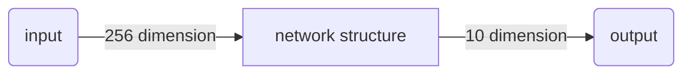

# Deep Learning

#### Ups and downs of Deep Learning

- 1958：Perceptron(linear model)，感知機的提出
  - 和 Logistic Regression 類似，只是少了 sigmoid 的部分
- 1969：Perceptron has limitation，from MIT
- 1980s：Multi-layer Perceptron，多層感知機
  - 和今天的 DNN 很像
- 1986：Backpropagation，反向傳播
  - Hinton propose 的 Backpropagation
  - 存在 problem：通常超過 3 個 layer 的 neural network，就 train 不出好的結果
- 1989: 1 hidden layer is 「good enough」，why deep？
  - 有人提出一個理論：只要 neural network 有一個 hidden layer，它就可以 model 出任何的 function，所以根本沒有必要疊加很多個 hidden layer，所以 Multi-layer Perceptron 的方法又壞掉了，這段時間 Multi-layer Perceptron 這個東西是受到抵制的
- 2006：RBM initialization(breakthrough)：Restricted Boltzmann Machine，受限玻爾茲曼機
  - Deep learning -> another Multi-layer Perceptron ？在當時看來，它們的不同之處在於在做 gradient descent 的時候選取初始值的方法如果是用 RBM，那就是 Deep learning；如果沒有用 RBM，就是傳統的 Multi-layer Perceptron
  - 那實際上呢，RBM 用的不是 neural network base 的方法，而是 graphical model，後來大家試驗得多了發現 RBM 並沒有什麼太大的幫助，因此現在基本上沒有人使用 RBM 做 initialization 了
  - RBM 最大的貢獻是，它讓大家重新對 Deep learning 這個 model 有了興趣(石頭湯的故事)
- 2009：GPU 加速的發現
- 2011：start to be popular in speech recognition，語音識別領域
- 2012：win ILSVRC image competition，Deep learning 開始在圖像領域流行開來

實際上，Deep learning 跟 machine learning 一樣，也是「大象放進冰箱」的三個步驟：

在 Deep learning 的 step1 里 define 的那個 function，就是 neural network

#### Neural Network

##### concept

把多個 Logistic Regression 前後 connect 在一起，然後把一個 Logistic Regression 稱之為 neuron，整個稱之為 neural network

我們可以用不同的方法連接這些 neuron，就可以得到不同的 structure，neural network 里的每一個 Logistic Regression 都有自己的 weight 和 bias，這些 weight 和 bias 集合起來，就是這個 network 的 parameter，我們用$\theta$來描述

##### Fully Connect Feedforward Network

那該怎麼把它們連接起來呢？這是需要你手動去設計的，最常見的連接方式叫做**Fully Connect Feedforward Network(全連接前饋網絡)**

如果一個 neural network 的參數 weight 和 bias 已知的話，它就是一個 function，它的 input 是一個 vector，output 是另一個 vector，這個 vector 裡面放的是樣本點的 feature，vector 的 dimension 就是 feature 的個數

如果今天我們還不知道參數，只是定出了這個 network 的 structure，只是決定好這些 neuron 該怎麼連接在一起，這樣的一個 network structure 其實是 define 了一個 function set(model)，我們給這個 network 設不同的參數，它就變成了不同的 function，把這些可能的 function 集合起來，我們就得到了一個 function set

只不過我們用 neural network 決定 function set 的時候，這個 function set 是比較大的，它包含了很多原來你做 Logistic Regression、做 linear Regression 所沒有辦法包含的 function

下圖中，每一排表示一個 layer，每個 layer 裡面的每一個球都代表一個 neuron

- layer 和 layer 之間 neuron 是兩兩互相連接的，layer 1 的 neuron output 會連接給 layer 2 的每一個 neuron 作為 input
- 對整個 neural network 來說，它需要一個 input，這個 input 就是一個 feature 的 vector，而對 layer 1 的每一個 neuron 來說，它的 input 就是 input layer 的每一個 dimension
- 最後那個 layer L，由於它後面沒有接其它東西了，所以它的 output 就是整個 network 的 output
- 這裡每一個 layer 都是有名字的
  - input 的地方，叫做**input layer**，輸入層(嚴格來說 input layer 其實不是一個 layer，它跟其他 layer 不一樣，不是由 neuron 所組成的)
  - output 的地方，叫做**output layer**，輸出層
  - 其餘的地方，叫做**hidden layer**，隱藏層
- 每一個 neuron 裡面的 sigmoid function，在 Deep Learning 中被稱為**activation function**(激勵函數)，事實上它不見得一定是 sigmoid function，還可以是其他 function(sigmoid function 是從 Logistic Regression 遷移過來的，現在已經較少在 Deep learning 里使用了)
- 有很多層 layers 的 neural network，被稱為**DNN(Deep Neural Network)**

**因為 layer 和 layer 之間，所有的 neuron 都是兩兩連接，所以它叫 Fully connected 的 network；因為現在傳遞的方向是從 layer 1->2->3，由後往前傳，所以它叫做 Feedforward network**

那所謂的 deep，是什麼意思呢？有很多層 hidden layer，就叫做 deep，具體的層數並沒有規定，現在只要是 neural network base 的方法，都被稱為 Deep Learning，下圖是一些 model 使用的 hidden layers 層數舉例

你會發現使用了 152 個 hidden layers 的 Residual Net，它識別圖像的準確率比人類還要高當然它不是使用一般的 Fully Connected Feedforward Network，它需要設計特殊的 special structure 才能訓練這麼深的 network

##### Matrix Operation

network 的運作過程，我們通常會用 Matrix Operation 來表示，以下圖為例，假設第一層 hidden layers 的兩個 neuron，它們的 weight 分別是$w_1=1,w_2=-2,w_1'=-1,w_2'=1$，那就可以把它們排成一個 matrix：$\begin{bmatrix}1 \ \ \ -2\\ -1 \ \ \ 1 \end{bmatrix}$，而我們的 input 又是一個 2\*1 的 vector：$\begin{bmatrix}1\\-1 \end{bmatrix}$，將 w 和 x 相乘，再加上 bias 的 vector：$\begin{bmatrix}1\\0 \end{bmatrix}$，就可以得到這一層的 vector z，再經過 activation function 得到這一層的 output：(activation function 可以是很多類型的 function，這裡還是用 Logistic Regression 遷移過來的 sigmoid function 作為運算)

$$
\sigma(\begin{bmatrix}1 \ \ \ -2\\ -1 \ \ \ 1 \end{bmatrix} \begin{bmatrix}1\\-1 \end{bmatrix}+\begin{bmatrix}1\\0 \end{bmatrix})=\sigma(\begin{bmatrix}4\\-2 \end{bmatrix})=\begin{bmatrix}0.98\\0.12 \end{bmatrix}
$$

這裡我們把所有的變量都以 matrix 的形式表示出來，注意$W^i$的 matrix，每一行對應的是一個 neuron 的 weight，行數就是 neuron 的個數，而 input x，bias b 和 output y 都是一個列向量，行數就是 feature 的個數(也是 neuron 的個數，neuron 的本質就是把 feature transform 到另一個 space)

把這件事情寫成矩陣運算的好處是，可以用 GPU 加速，GPU 對 matrix 的運算是比 CPU 要來的快的，所以我們寫 neural network 的時候，習慣把它寫成 matrix operation，然後 call GPU 來加速它

##### Output Layer

我們可以把 hidden layers 這部分，看做是一個**feature extractor(特徵提取器)**，這個 feature extractor 就 replace 了我們之前手動做 feature engineering，feature transformation 這些事情，經過這個 feature extractor 得到的$x_1,x_2,...,x_k$就可以被當作一組新的 feature

output layer 做的事情，其實就是把它當做一個**Multi-class classifier**，它是拿經過 feature extractor 轉換後的那一組比較好的 feature(能夠被很好地 separate)進行分類的，由於我們把 output layer 看做是一個 Multi-class classifier，所以我們會在最後一個 layer 加上**softmax**

#### Example Application

##### Handwriting Digit Recognition

這裡舉一個手寫數字識別的例子，input 是一張 image，對機器來說一張 image 實際上就是一個 vector，假設這是一張 16\*16 的 image，那它有 256 個 pixel，對 machine 來說，它是一個 256 維的 vector，image 中的每一個都對應到 vector 中的一個 dimension，簡單來說，我們把黑色的 pixel 的值設為 1，白色的 pixel 的值設為 0

而 neural network 的 output，如果在 output layer 使用了 softmax，那它的 output 就是一個突出極大值的 Probability distribution，假設我們的 output 是 10 維的話(10 個數字，0~9)，這個 output 的每一維都對應到它可能是某一個數字的幾率，實際上這個 neural network 的作用就是計算這張 image 成為 10 個數字的幾率各自有多少，幾率最大(softmax 突出極大值的意義所在)的那個數字，就是機器的預測值

在這個手寫字體識別的 demo 里，我們唯一需要的就是一個 function，這個 function 的 input 是一個 256 的 vector，output 是一個 10 維的 vector，這個 function 就是 neural network(這裡我們用簡單的 Feedforward network)

input 固定為 256 維，output 固定為 10 維的 feedforward neural network，實際上這個 network structure 就已經確定了一個 function set(model)的形狀，在這個 function set 里的每一個 function 都可以拿來做手寫數字識別，接下來我們要做的事情是用 gradient descent 去計算出一組參數，挑一個最適合拿來做手寫數字識別的 function

==**注：input、output 的 dimension，加上 network structure，就可以確定一個 model 的形狀，前兩個是容易知道的，而決定這個 network 的 structure 則是整個 Deep Learning 中最為關鍵的步驟**==

所以這裡很重要的一件事情是，我們要對 network structure 進行 design，之前在做 Logistic Regression 或者是 linear Regression 的時候，我們對 model 的 structure 是沒有什麼好設計的，但是對 neural network 來說，我們現在已知的 constraint 只有 input 是 256 維，output 是 10 維，而中間要有幾個 hidden layer，每個 layer 要有幾個 neuron，都是需要我們自己去設計的，它們近乎是決定了 function set 長什麼樣子

如果你的 network structure 設計的很差，這個 function set 裡面根本就沒有好的 function，那就會像大海撈針一樣，結果針並不在海裡(滑稽

##### Step 1：Neural Network

input 256 維，output 10 維，以及自己 design 的 network structure =》function set(model)

##### Step 2：Goodness of function

定義一個 function 的好壞，由於現在我們做的是一個 Multi-class classification，所以 image 為數字 1 的 label 「1」告訴我們，現在的 target 是一個 10 維的 vector，只有在第一維對應數字 1 的地方，它的值是 1，其他都是 0

input 這張 image 的 256 個 pixel，通過這個 neural network 之後，會得到一個 output，稱之為 y；而從這張 image 的 label 中轉化而來的 target，稱之為$\hat{y}$，有了 output $y$和 target $\hat{y}$之後，要做的事情是計算它們之間的 cross entropy(交叉熵)，這個做法跟我們之前做 Multi-class classification 的時候是一模一樣的

$$
Cross \ Entropy :l(y,\hat{y})=-\sum\limits_{i=1}^{10}\hat{y}_i lny_i
$$

##### Step 3：Pick the best function

接下來就去調整參數，讓這個 cross entropy 越小越好，當然整個 training data 裡面不會只有一筆 data，你需要把所有 data 的 cross entropy 都 sum 起來，得到一個 total loss $L=\sum\limits_{n=1}^Nl^n$，得到 loss function 之後你要做的事情是找一組 network 的 parameters：$\theta^*$，它可以 minimize 這個 total loss，這組 parameter 對應的 function 就是我們最終訓練好的 model

那怎麼去找這個使 total loss minimize 的$\theta^*$呢？使用的方法就是我們的老朋友——**Gradient Descent**

實際上在 deep learning 裡面用 gradient descent，跟在 linear regression 裡面使用完全沒有什麼差別，只是 function 和 parameter 變得更複雜了而已，其他事情都是一模一樣的

現在你的$\theta$裡面是一大堆的 weight、bias 參數，先 random 找一個初始值，接下來去計算每一個參數對 total loss 的偏微分，把這些偏微分全部集合起來，就叫做 gradient，有了這些偏微分以後，你就可以更新所有的參數，都減掉 learning rate 乘上偏微分的值，這個 process 反復進行下去，最終找到一組好的參數，就做完 deep learning 的 training 了

##### toolkit

你可能會問，這個 gradient descent 的 function 式子到底是長什麼樣子呢？之前我們都是一步一步地把那個算式推導出來的，但是在 neural network 裡面，有成百上千個參數，如果要一步一步地人工推導並求微分的話是比較困難的，甚至是不可行的

其實，在現在這個時代，我們不需要像以前一樣自己去 implement Backpropagation(反向傳播)，因為有太多太多的 toolkit 可以幫你計算 Backpropagation，比如**tensorflow、pytorch**

注：Backpropagation 就是算微分的一個比較有效的方式

##### something else

所以，其實 deep learning 就是這樣子了，就算是 alpha go，也是用 gradient descent train 出來的，可能在你的想象中它有多麼得高大上，實際上就是在用 gradient descent 這樣樸素的方法

##### 有一些常見的問題：

Q：有人可能會問，機器能不能自動地學習 network 的 structure？

- 其實是可以的，基因演算法領域是有很多的 technique 是可以讓 machine 自動地去找出 network structure，只不過這些方法目前沒有非常普及

Q：我們可不可以自己去 design 一個新的 network structure，比如說可不可以不要 Fully connected layers(全連接層)，自己去 DIY 不同 layers 的 neuron 之間的連接？

- 當然可以，一個特殊的接法就是 CNN(Convolutional Neural Network)，即卷積神經網絡，這個下一章節會介紹

##### Why Deep？

最後還有一個問題，為什麼我們要 deep learning？一個很直覺的答案是，越 deep，performance 就越好，一般來說，隨著 deep learning 中的 layers 數量增加，error 率不斷降低

但是，稍微有一點 machine learning 常識的人都不會覺得太 surprise，因為本來 model 的 parameter 越多，它 cover 的 function set 就越大，它的 bias 就越小，如果今天你有足夠多的 training data 去控制它的 variance，一個比較複雜、參數比較多的 model，它 performance 比較好，是很正常的，那變 deep 有什麼特別了不起的地方？

甚至有一個理論是這樣說的，任何連續的 function，它 input 是一個 N 維的 vector，output 是一個 M 維的 vector，它都可以用一個 hidden layer 的 neural network 來表示，只要你這個 hidden layer 的 neuron 夠多，它可以表示成任何的 function，既然一個 hidden layer 的 neural network 可以表示成任何的 function，而我們在做 machine learning 的時候，需要的東西就只是一個 function 而已，那做 deep 有什麼特殊的意義呢？

所以有人說，deep learning 就只是一個噱頭而已，因為做 deep 感覺比較潮，如果你只是增加 neuron 把它變寬，變成 fat neural network，那就感覺太「虛弱」了，所以我們要做 deep learning，給它增加 layers 而不是增加 neuron：DNN(deep) is better than FNN(fat)

真的是這樣嗎？後面的章節會解釋這件事情

#### Design network structure V.s. Feature Engineering

> 下面聊一些經驗之談

其實 network structure 的 design 是一件蠻難的事情，我們到底要怎麼決定 layer 的數目和每一個 layer 的 neuron 的數目呢？其實這個只能夠憑著經驗和直覺、多方面的嘗試，有時候甚至會需要一些 domain knowledge(專業領域的知識)，從非 deep learning 的方法到 deep learning 的方法，並不是說 machine learning 比較簡單，而是我們把一個問題轉化成了另一個問題

本來不是 deep learning 的 model，要得到一個好的結果，往往需要做 feature engineering(特徵工程)，也就是做 feature transform，然後找一組好的 feature；一開始學習 deep learning 的時候，好像會覺得 deep learning 的 layers 之間也是在做 feature transform，但實際上在做 deep learning 的時候，往往不需要一個好的 feature ，比如說在做影像辨識的時候，你可以把所有的 pixel 直接丟進去，但是在過去做圖像識別，你是需要對圖像抽取出一些人定的 feature 出來的，這件事情就是 feature transform，但是有了 deep learning 之後，你完全可以直接丟 pixel 進去硬做

但是，今天 deep learning 製造了一個新的問題，它所製造的問題就是，你需要去 design network 的 structure，所以==**你的問題從本來的如何抽取 feature 轉化成怎麼 design network structure**==，所以 deep learning 是不是真的好用，取決於你覺得哪一個問題比較容易

如果是影響辨識或者是語音辨識的話，design network structure 可能比 feature engineering 要來的容易，因為，雖然我們人都會看、會聽，但是這件事情，它太過潛意識了，它離我們意識的層次太遠，我們無法意識到，我們到底是怎麼做語音辨識這件事情，所以對人來說，你要抽一組好的 feature，讓機器可以很方便地用 linear 的方法做語音辨識，其實是很難的，因為人根本就不知道好的 feature 到底長什麼樣子；所以還不如 design 一個 network structure，或者是嘗試各種 network structure，讓 machine 自己去找出好的 feature，這件事情反而變得比較容易，對影像來說也是一樣的

有這麼一個說法：deep learning 在 NLP 上面的 performance 並沒有那麼好。語音辨識和影像辨識這兩個領域是最早開始用 deep learning 的，一用下去進步量就非常地驚人，比如錯誤率一下子就降低了 20%這樣，但是在 NLP 上，它的進步量似乎並沒有那麼驚人，甚至有很多做 NLP 的人，現在認為說 deep learning 不見得那麼 work，這個原因可能是，人在做 NLP 這件事情的時候，由於人在文字處理上是比較強的，比如叫你設計一個 rule 去 detect 一篇 document 是正面的情緒還是負面的情緒，你完全可以列表，列出一些正面情緒和負面情緒的詞彙，然後看這個 document 裡面正面情緒的詞彙出現的百分比是多少，你可能就可以得到一個不錯的結果。所以 NLP 這個 task，對人來說是比較容易設計 rule 的，你設計的那些 ad-hoc(特別的)的 rule，往往可以得到一個還不錯的結果，這就是為什麼 deep learning 相較於 NLP 傳統的方法，覺得沒有像其他領域一樣進步得那麼顯著(但還是有一些進步的)

長久而言，可能文字處理中會有一些隱藏的資訊是人自己也不知道的，所以讓機器自己去學這件事情，還是可以佔到一些優勢，只是眼下它跟傳統方法的差異看起來並沒有那麼的驚人，但還是有進步的
